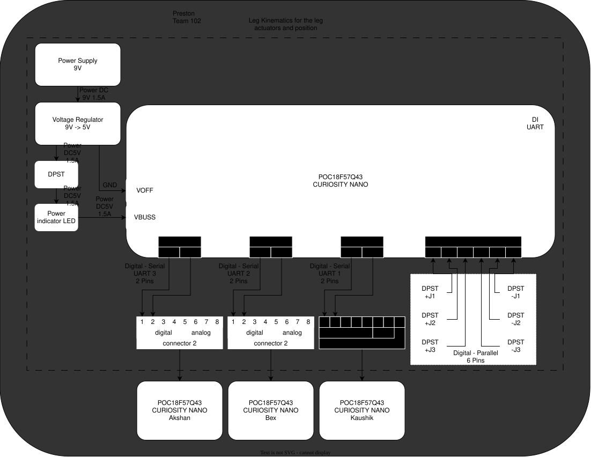

---

## Overview
The purpose of this chip is to act as a controller for the rest of the chips that are acting as motor drivers and sensor processers.
* 9V 1.5A source
* Kinematics 
* 6 push buttons for joint control
* power light indicator
* UART

## Block Diagram 

